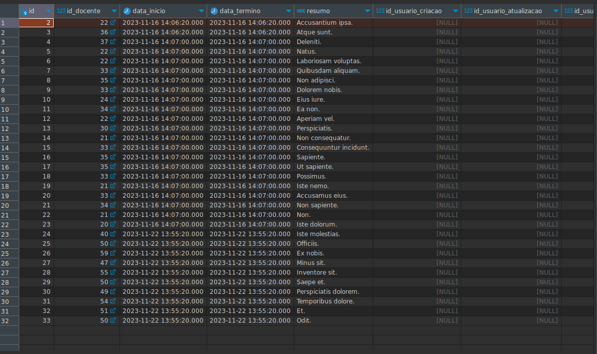

## Criando uma factory

```php artisan make:factory {NomedaModel}```

Será gerada uma Factory. Onde gera-se os os dados das colunas da tabela que serão usadas no banco de dados.


# Exemplo criação de Factory

Nesse documento temos os principais comandos e códigos para criar uma factory para o backend do projeto.

TODO: Explicar como a factory sabe qual é a sua respectiva entidade

## Códido para gerar a factory

1. Preparar o retorno da Factory
   
* O Código abaixo é gerado automaticamente pelo laravel e serve para gerar dados para a tabela.

```php
    public function definition(): array
    {
        return [
            //'id'=>mt_rand(1, 20),
            //'id_user'=>mt_rand(1, 20),
            'id_docente'=>mt_rand(40, 60),
            'id_processo'=>mt_rand(1,20),
            'data_inicio'=>now(),
            'data_termino'=>now(),
            'resumo'=>fake()->sentence(1),
        ];
    } 
```
Foi adicionado o faker para gerar dados fake para a tabela como um prototipo de dados. Para mais informações pesquisar sobre a biblioteca do método faker.

# Execução da factory
#### Caminho para a execução da factory:

1. Execute o comando: 

```shell 
 php artisan tinker
```
   >* Este comando é responsável por **abrir o terminal php**.

2. Execute o comando:
```php
App\Models\{caminhoParaSuaModel}::factory(10)->create();
```
 > * Este comando é responsavel por **popular o banco de dados**.

Podemos verificar os registros criados usando o dbeaver ou instanciando uma [Service](../Resumo/10_Service.md) :


