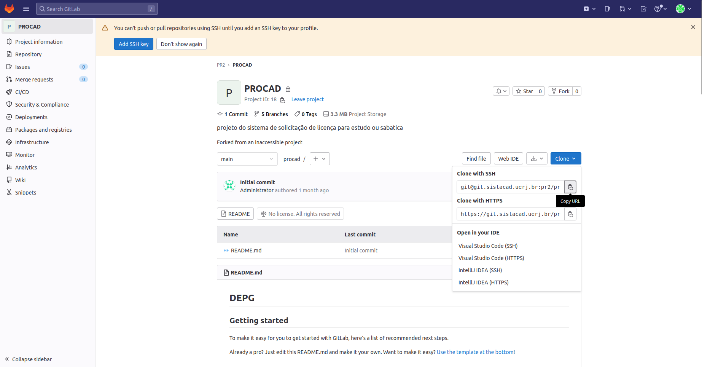

#Clonar projeto

Para Clonar o projeto, você deve acessar o gitlab através do link:
```
 git.sistacad.uerj.br/
```
Se autenticar e acessar o projeto PROCAD, em seguida clicar em clone e copiar o link SSH.



Dentro da pasta em que irá clonar o repositório do projeto, abra o terminal e use o seguinte comando:

```git
git clone LinkCopiado
```
em seguida o Git irá pedir seu usuário e senha para confirmar o clone.
Ao termino você estará com uma cópia local do sistema.
